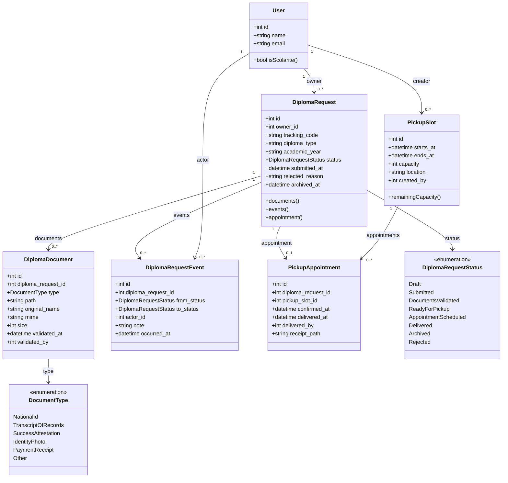

# Diagramme de classes — Module 8



## Couches applicatives

```mermaid
flowchart TB
    Routes[/routes/diplomas.php/]
    Mw[Middleware\nstudent / scolarite]
    FR[FormRequests\nauthorize via Policy]
    Ctrl[Controllers (thin)]
    Pol[Policies]
    Pre[Presenters]
    Svc[Services\nDiplomaRequestService\nPickupService\nDashboardService]
    Mod[(Models Eloquent)]
    Obs[Observer\nDiplomaRequestEventObserver]
    Notif[Notifications\nDiplomaRequestStatusChanged\nPickupReminder]

    Routes --> Mw --> FR --> Ctrl
    Ctrl --> Pol
    Ctrl --> Svc
    Ctrl --> Pre
    Svc --> Mod
    Mod -.created event.-> Obs
    Obs --> Notif
```

Les contrôleurs ne portent pas de logique métier : ils appliquent l'autorisation (Policies via FormRequest ou `$this->authorize`), délèguent au Service, et passent le payload au Presenter pour Inertia.
