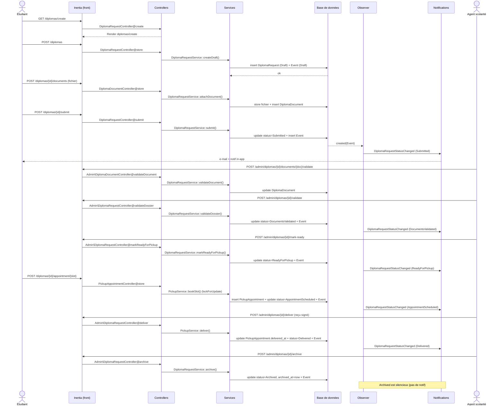

# Diagramme de séquence — Du dépôt au retrait

Trajet nominal d'une demande, de la création à la remise du diplôme.

```mermaid
sequenceDiagram
    actor E as Étudiant
    participant UI as Inertia (front)
    participant C as Controllers
    participant S as Services
    participant DB as Base de données
    participant O as Observer
    participant N as Notifications
    actor A as Agent scolarité

    E->>UI: GET /diplomas/create
    UI->>C: DiplomaRequestController@create
    C-->>UI: Render diplomas/create
    E->>UI: POST /diplomas
    UI->>C: DiplomaRequestController@store
    C->>S: DiplomaRequestService::createDraft()
    S->>DB: insert DiplomaRequest (Draft) + Event (Draft)
    DB-->>S: ok

    E->>UI: POST /diplomas/{id}/documents (fichier)
    UI->>C: DiplomaDocumentController@store
    C->>S: DiplomaRequestService::attachDocument()
    S->>DB: store fichier + insert DiplomaDocument

    E->>UI: POST /diplomas/{id}/submit
    UI->>C: DiplomaRequestController@submit
    C->>S: DiplomaRequestService::submit()
    S->>DB: update status=Submitted + insert Event
    DB-->>O: created(Event)
    O->>N: DiplomaRequestStatusChanged (Submitted)
    N-->>E: e-mail + notif in-app

    A->>UI: POST /admin/diplomas/{id}/documents/{doc}/validate
    UI->>C: Admin\DiplomaDocumentController@validateDocument
    C->>S: DiplomaRequestService::validateDocument()
    S->>DB: update DiplomaDocument

    A->>UI: POST /admin/diplomas/{id}/validate
    UI->>C: Admin\DiplomaRequestController@validateDossier
    C->>S: DiplomaRequestService::validateDossier()
    S->>DB: update status=DocumentsValidated + Event
    O->>N: DiplomaRequestStatusChanged (DocumentsValidated)

    A->>UI: POST /admin/diplomas/{id}/mark-ready
    UI->>C: Admin\DiplomaRequestController@markReadyForPickup
    C->>S: DiplomaRequestService::markReadyForPickup()
    S->>DB: update status=ReadyForPickup + Event
    O->>N: DiplomaRequestStatusChanged (ReadyForPickup)

    E->>UI: POST /diplomas/{id}/appointment/{slot}
    UI->>C: PickupAppointmentController@store
    C->>S: PickupService::bookSlot() (lockForUpdate)
    S->>DB: insert PickupAppointment + update status=AppointmentScheduled + Event
    O->>N: DiplomaRequestStatusChanged (AppointmentScheduled)

    A->>UI: POST /admin/diplomas/{id}/deliver (reçu signé)
    UI->>C: Admin\DiplomaRequestController@deliver
    C->>S: PickupService::deliver()
    S->>DB: update PickupAppointment.delivered_at + status=Delivered + Event
    O->>N: DiplomaRequestStatusChanged (Delivered)

    A->>UI: POST /admin/diplomas/{id}/archive
    UI->>C: Admin\DiplomaRequestController@archive
    C->>S: DiplomaRequestService::archive()
    S->>DB: update status=Archived, archived_at=now + Event
    Note over O,N: Archived est silencieux (pas de notif)
```
