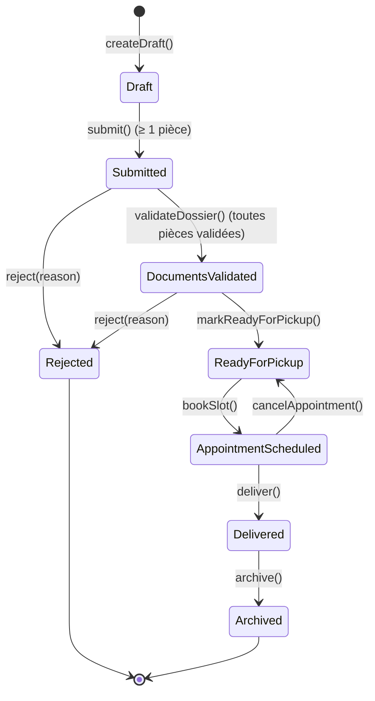

# Machine à états — `DiplomaRequest`

L'enum [`DiplomaRequestStatus`](../../../app/Enums/DiplomaRequestStatus.php) modélise le cycle de vie d'une demande de retrait. Les transitions sont opérées par les services ([`DiplomaRequestService`](../../../app/Services/DiplomaRequestService.php) et [`PickupService`](../../../app/Services/PickupService.php)) et tracées dans la table `diploma_request_events`.

## Garde-fous principaux

| Transition | Garde |
|---|---|
| `Draft → Submitted` | `documents().count() >= SUBMISSION_MINIMUM_DOCUMENTS` |
| `Submitted → DocumentsValidated` | toutes les pièces ont `validated_at != null` |
| `ReadyForPickup → AppointmentScheduled` | `lockForUpdate` sur le créneau + capacité disponible + créneau futur |
| `AppointmentScheduled → ReadyForPickup` | RDV existant + non remis |
| `Delivered → Archived` | aucune autre garde technique, manuel |

## Transitions notifiées

L'observer [`DiplomaRequestEventObserver`](../../../app/Observers/DiplomaRequestEventObserver.php) déclenche [`DiplomaRequestStatusChanged`](../../../app/Notifications/Diplomas/DiplomaRequestStatusChanged.php) (mail + base) sur :

- `Submitted`, `DocumentsValidated`, `Rejected`, `AppointmentScheduled`, `Delivered`,
- `ReadyForPickup` **uniquement** quand la transition vient de `DocumentsValidated` (pas après annulation de RDV).

`Draft` et `Archived` sont silencieux. Le rappel J-1 est porté séparément par [`PickupReminder`](../../../app/Notifications/Diplomas/PickupReminder.php) et la commande planifiée [`SendPickupReminders`](../../../app/Console/Commands/SendPickupReminders.php).
