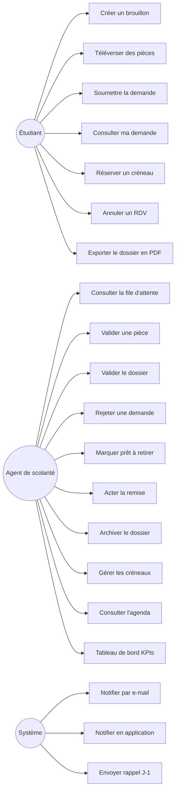

# Diagramme de cas d'utilisation — Module 8

## Acteurs

- **Étudiant** — diplômé qui dépose et suit sa demande de retrait.
- **Agent de scolarité** (scolarité) — instruit les dossiers, gère les créneaux, remet les diplômes.

## Diagramme

## Description synthétique

| ID | Cas | Acteur principal | Précondition | Postcondition |
|---|---|---|---|---|
| UC1 | Créer un brouillon | Étudiant | Authentifié | `DiplomaRequest` en statut `draft` |
| UC2 | Téléverser pièce | Étudiant | Brouillon ouvert | Document persisté + lié à la demande |
| UC3 | Soumettre la demande | Étudiant | Brouillon avec ≥ 1 pièce | Statut → `submitted`, e-mail envoyé |
| UC11 | Valider pièce | Scolarité | Demande `submitted` | Document marqué validé |
| UC12 | Valider le dossier | Scolarité | Toutes pièces validées | Statut → `documents_validated` |
| UC13 | Rejeter | Scolarité | Statut `submitted` ou `documents_validated` | Statut → `rejected` + motif enregistré |
| UC14 | Marquer prêt | Scolarité | Statut `documents_validated` | Statut → `ready_for_pickup` |
| UC5 | Réserver créneau | Étudiant | Statut `ready_for_pickup`, créneau futur non plein | RDV créé, statut → `appointment_scheduled` |
| UC15 | Acter la remise | Scolarité | RDV programmé | Statut → `delivered`, reçu signé optionnel stocké |
| UC16 | Archiver | Scolarité | Statut `delivered` | Statut → `archived` |
| UC22 | Rappel J-1 | Système (cron) | Existence d'un RDV demain non remis | Notification e-mail + in-app envoyée |
