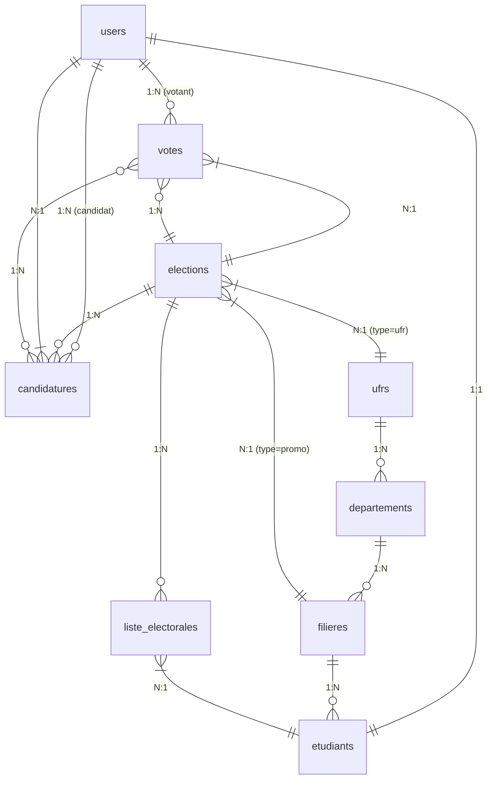

# Architecture Base de Données - UnivEvent

## 📋 **Tableau des Tables & Relations**

### **Tables Principales (avec PK custom)**

| Table | PK | Fillable | Statuts/Enums | Relations |
|-------|----|----------|---------------|-----------|
| `users` | `id` | standard Laravel | `roles` (pivot?) | 1:1 `etudiant`, 1:N `votes`, 1:N `candidatures` |
| `ufrs` | `id_ufr` | `nom`, `sigle` | - | 1:N `departements`, 1:N `elections` (type=ufr) |
| `departements` | `id_departement` | `nom`, `id_ufr` | - | 1:N `filieres`, 1:N `etudiants` |
| `filieres` | `id_filiere` | `nom`, `id_departement` | - | 1:N `etudiants`, 1:N `elections` (type=promotion) |
| `etudiants` | `id` | `nom`, `niveau` (L1..Doc), `id_filiere`, `statut` | `statut: inscrit` | 1:1 `user`, N:1 `liste_electorale` |
| `elections` | `id_election` | `titre`, `type` (ufr/promotion), `statut` (brouillon..terminee), `tour` (1/2), `date_debut/fin`, `id_ufr/filiere` | `statut: brouillon,liste_generee,planifiee,ouverte,cloturee,second_tour,terminee` | 1:N `liste_electorales`, 1:N `candidatures`, 1:N `votes`, N:1 `ufr/filiere` |
| `liste_electorales` | auto | `id_election`, `id_etudiant`, `statut_snapshot` | - | N:1 `election`, N:1 `etudiant` |
| `candidatures` | `id_candidature` | `programme`, `statut`, `resultat` (second_tour/eliminee), `id_user`, `id_election`, fichiers (photo, PDFs) | `statut: en_attente,validee,rejetee`<br>`resultat: second_tour,eliminee` | N:1 `user`, N:1 `election`, 1:N `votes` |
| `votes` | `id_vote` | `id_user`, `id_election`, `id_candidature`, `tour`, `date_vote` | `tour: 1/2` | N:1 `user`, N:1 `election`, N:1 `candidature` |

### **Hiérarchie Académique (1:N chain)**
```
UFR (id_ufr)
  ↓ 1:N
Departement (id_departement, id_ufr)
  ↓ 1:N
Filiere (id_filiere, id_departement)
  ↓ 1:N
Etudiant (id, id_filiere, niveau, statut=inscrit)
  ↓ 1:1 (via user_id?)
User (id) ← Étudiants votants
```

### **Cycle Élection (Event-driven)**
```
Election (id_election, type, statut, tour)
  ↓ hasMany
ListeElectorale (pivot, filtre niveau pour promo)
  ↓ hasMany (indirect)
Candidature (id_candidature, statut, id_election, id_user)
  ↓ hasMany
Vote (id_vote, tour=1/2, id_user UNIQUE par election/tour, id_candidature)
```

## 🗺️ **Diagramme ERD (Mermaid)**



## 🔍 **Contraintes Clés**
- **Unique Vote**: `(id_user, id_election, tour)` → Pas de double-vote
- **Autorisation**: `ListeElectorale` vérif avant vote
- **Second Tour**: Candidatures `resultat=second_tour` (top 2 auto)
- **Snapshot**: `statut_snapshot` dans ListeElectorale
- **SoftDeletes**: Toutes entités principales

## 📈 **Stats & Échelles**
- 1 Élection → 1000+ électeurs (Promo)
- Second tour dynamique
- Live tallying sans race conditions

**Base solide pour élections universitaires!**

